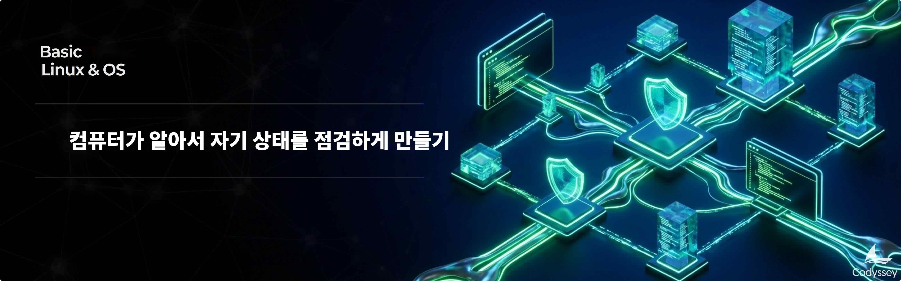

# B1-1: 컴퓨터가 알아서 자기 상태를 점검하게 만들기

## 📋 과제 정보

| 항목 | 내용 |
|------|------|
| **과목** | Linux와 OS (Linux & OS) |
| **난이도** | ★☆☆ (Lv.1) |
| **학습 시간** | 40분 |
| **필수 여부** | ✅ 필수 |
| **진행 상태** | PASS |
| **과제 번호** | 185004 |

---

## 🎯 미션 설명



---

## 🛠️ 개발 환경

### 6\. 개발 환경

*   Ubuntu 22.04 LTS 또는 동등 리눅스 환경
*   이전 미션에서 구성한 Linux 실습 환경(컨테이너/VM)을 그대로 사용 권장

---

## ⚠️ 제약 사항

### 7\. 제약 사항

*   구현 언어/도구
    *   자동화 스크립트는 Bash로만 작성한다(Python 등으로 대체 금지)
    *   필요한 경우에만 sudo 사용(가능한 일반 계정으로 진행)
*   제공 애플리케이션
    *   제공된 Python 앱은 “실행 대상”이며, 과제의 핵심은 관제/자동화 스크립트 구현이다.

---

## 📝 결과 예시

### 8\. 결과 예시

아래는 정답이 아니라 참고 예시다. 실제 문구와 구성은 달라도 된다.

*   앱 Boot Sequence 출력 예시
    
    ```css
    > Starting Agent Boot Sequence...
    [1/5] Checking User Account               [OK]
    ... Running as service user 'agent-admin' (uid=1001)
    [2/5] Verifying Environment Variables     [OK]
    ... All required Envs correct
    [3/5] Checking Required Files             [OK]
    ... Verified key file with correct key string.
    [4/5] Checking Port Availability          [OK]
    ... Port 15034 is available.
    [5/5] Verifying Log Permission            [OK]
    ... Log directory is writable: /var/log/agent-app
    ------------------------------------------------------------
    All Boot Checks Passed!
    Agent READY
    ```
    
*   [monitor.sh](http://monitor.sh) 콘솔 출력 예시
    
    ```css
    ====== SYSTEM MONITOR RESULT ======
    
    [HEALTH CHECK]
    Checking process 'agent_app.py'... [OK] (PID: 48291)
    Checking port 15034... [OK]
    
    [RESOURCE MONITORING]
    CPU Usage : 25.3%
    MEM Usage : 5.2%
    DISK Used  : 23%
    
    [WARNING] CPU threshold exceeded (25.3% > 20%)
    
    ====== STATISTICS REPORT ======
    [CPU]
    Average : 21.4%
    Maximum : 25.3% at 2026-02-25 14:00:05
    Minimum : 10.2% at 2026-02-25 13:58:05
    [Memory]
    Average : 6.1%
    Maximum : 9.8% at 2026-02-25 14:00:05
    Minimum : 3.2% at 2026-02-25 13:58:05
    [Samples]
    Data Points: 10 samples
    
    [INFO] Log appended: /var/log/agent-app/monitor.log
    ```
    
*   monitor.log 누적 예시
    
    ```css
    [2026-02-25 13:58:01] PID:48291 CPU:10.2% MEM:3.2% DISK_USED:23%
    [2026-02-25 13:59:01] PID:48291 CPU:18.7% MEM:5.0% DISK_USED:23%
    [2026-02-25 14:00:01] PID:48291 CPU:25.3% MEM:9.8% DISK_USED:23%
    ```
    
*   (보너스 수행 시) report.sh 콘솔 출력 예시
    
    ```css
        ====== STATISTICS REPORT ======
          [CPU]
            Average : 21.4%
            Maximum : 25.3% at 2026-02-25 14:00:05
            Minimum : 10.2% at 2026-02-25 13:58:05
          [Memory]
            Average : 6.1%
            Maximum : 9.8% at 2026-02-25 14:00:05
            Minimum : 3.2% at 2026-02-25 13:58:05
          [Samples]
            Data Points: 10 samples
    ```

---

## 📦 제공 파일

agent-app-linux-x86 (x86)
agent-app-linux-arm64 (arm apple)

**다운로드**: https://dvg0ukilu1mqr.cloudfront.net/pjt7938015c-b538-4ab0-b52d-d512f7476603_agent-app.zip

---

## 📊 평가 정보

- 평가 대상: 예

---

> *이 문서는 Codyssey AI/SW 기초 과정의 과제 내용을 기반으로 자동 생성되었습니다.*
